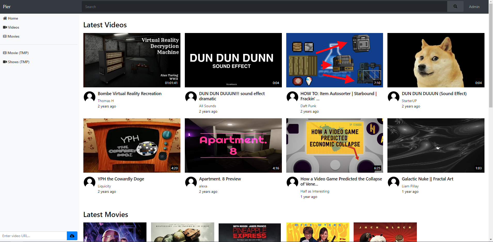

# Ocean Pier

**A NextJS Raspberry Pi Home Server**



A home media center made for use with Raspberry Pi 4 Model B (though should work on other devices)
Connect to your Pier server by going to it's IP address in the browser of your choice. For example in Google Chrome's address bar enter the server's ip address (example: `192.168.8.77/`) or simply go to the device's name which should be by default `raspberrypi/`.

**Advantages over Pier Legacy**

- Requires only 2 dependencies
- Much easier to install
- More efficient runtime
- More responsive interface

## Dependencies:

- NodeJS V16.10+
- NPM V8+
- FFMPEG
- FFPROBE

## Supported Architectures

- All Windows versions from Vista SP2+ and onwards
- Linux/BSD armv7l, aarch64, x86, x64
- All MacOS versions 10.9+ and onwards

## Notes

### Automatic Updates

The included `yt-dlp` version automatically updates. Please replace the `yt-dlp` binary in the `/public/bin/yt-dlp/` folder with one compatible for your operating system and architecture if you do not want this functionality.

Find `yt-dlp` releases here: [yt-dlp releases](https://github.com/yt-dlp/yt-dlp#release-files)

# Developers

All information below is only necessary for those wanting to contribute to, or edit the project.

## Tests

Tests in this application define the product case. Do not modify these. If you are finding your tests are failing, please update the code to match the tests, not the other way around.

## Sample .ENV

```sh
DATABASE_URL="file:./dev.db" # Prisma db
DEBUG_MODE="true"
```

## Required VSCode Extensions

- [ESLint](https://marketplace.visualstudio.com/items?itemName=dbaeumer.vscode-eslint)
- [Prisma](https://marketplace.visualstudio.com/items?itemName=Prisma.prisma)
- [Code Spell Checker](https://marketplace.visualstudio.com/items?itemName=streetsidesoftware.code-spell-checker)

## Naming Conventions

All time units are stored in milliseconds (ms) unless otherwise specified.

## API

The API is handled by [Next](./docs/packages/README.md#Next) but is built out using a [services](./docs/api/README.md#services-directory) architecture.

Please read the [API readme](./docs/api/README.md) before interacting with or building out the API or any services.

## Packages

All packages added should have their reason stated on the [packages readme](./docs/packages/README.md). This project should have minimal dependencies and modifications to the `package.json`.

Read more here: [packages readme!](./docs/packages/README.md)

# Licenses

- [Ion-Icons](./public/ion-icons/LICENSE) (MIT License)
